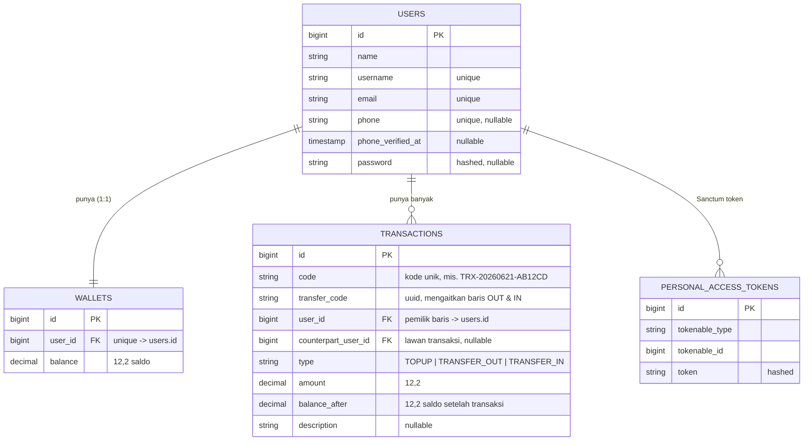

# TrustPay — Mini Wallet API & Dashboard

Aplikasi **dompet digital (mini wallet)** bertema *"Buku Tabungan Digital"*: setiap
transaksi tercatat per baris dan bisa diaudit. Dibuat untuk Exam Penyaluran Kerja
Full Stack Web Development.

- **Backend:** REST API (Laravel + Sanctum, MySQL) — auth, wallet, transfer dengan
  *database transaction*, validasi ketat, dan proteksi per-user.
- **Frontend:** Single Page Application (React + Vite) — halaman Login, Register,
  dan Dashboard (saldo, top up, transfer, riwayat).

---

## 🧱 Tech Stack

| Layer | Teknologi |
|-------|-----------|
| Backend | PHP 8.2+, **Laravel 13**, **Laravel Sanctum** (token auth), bcmath |
| Database | MySQL |
| Frontend | **React 18**, **Vite 5**, React Router 6, `qrcode.react` |
| OTP (bonus) | Fonnte (WhatsApp gateway), dengan fallback channel `log` untuk dev |

---

## 🗂️ Struktur Folder

```
TrustPay/
├── backend/     # Laravel API (folder kerja: php artisan ...)
├── frontend/    # React SPA (folder kerja: npm run ...)
├── PRD.md, design.md, README.md
```

---

## 🧬 ERD (Entity Relationship Diagram)



**Catatan model:**
- 1 **User** punya 1 **Wallet** (`hasOne`) dan banyak **Transaction** (`hasMany`).
- Transfer mencatat **2 baris**: `TRANSFER_OUT` (pengirim) & `TRANSFER_IN` (penerima),
  dihubungkan `transfer_code` yang sama — mutasi tiap user berdiri sendiri
  (User A tidak melihat baris milik User B).

---

## ▶️ Cara Menjalankan Project

### 1) Backend (Laravel)
```bash
cd backend
composer install
cp .env.example .env          # isi DB_DATABASE / DB_USERNAME / DB_PASSWORD
php artisan key:generate
php artisan migrate --seed     # buat tabel + akun demo
php artisan serve              # http://127.0.0.1:8000
```

### 2) Frontend (React)
```bash
cd frontend
npm install
# (opsional) buat .env berisi: VITE_API_URL=http://127.0.0.1:8000/api
npm run dev                    # http://localhost:5173
```

> Default `VITE_API_URL` = `/api`. Saat dev terpisah, set ke `http://127.0.0.1:8000/api`.
> CORS sudah mengizinkan origin `FRONTEND_URL` (default `http://localhost:5173`).
> **Penting:** setiap mengubah `.env` backend, restart `php artisan serve`.

### Akun demo (hasil seeder)
Login pakai **email/username + password** — password semua akun: **`password123`**.

| Username | Email | Saldo |
|----------|-------|-------|
| `@aldi` | demo@trustpay.id | Rp 2.450.000 |
| `@budi` `@siti` `@reza` `@dewi` `@rina` | …@trustpay.id | bervariasi (tujuan transfer) |

---

## 🔌 API Endpoints

Endpoint di bawah `auth:sanctum` butuh header `Authorization: Bearer <token>`.

| Method | Endpoint | Auth | Keterangan |
|--------|----------|------|------------|
| POST | `/api/register` | – | name, username, email, phone?, password → **token** |
| POST | `/api/login` | – | login (email/username) + password → **token** |
| POST | `/api/login/request-otp` | – | *(bonus)* phone → kirim OTP WhatsApp |
| POST | `/api/verify-otp` | – | *(bonus)* phone + code → **token** |
| POST | `/api/logout` | ✓ | hapus token aktif |
| GET | `/api/me` | ✓ | profil user login |
| GET | `/api/wallet` | ✓ | saldo saat ini |
| POST | `/api/topup` | ✓ | amount → tambah saldo |
| POST | `/api/transfer` | ✓ | recipient (email/HP/username) + amount → transfer |
| GET | `/api/transactions` | ✓ | riwayat mutasi (hanya milik user login) |

### Kode status
- **201** register sukses · **200** sukses umum
- **401** belum/keliru autentikasi (token salah / password salah)
- **422** input tidak valid (email `user@`, password < 8, username dipakai; nominal `abc`/kosong/desimal/negatif)
- **400** aturan bisnis dilanggar (mis. *"Saldo tidak cukup."*)

---

## 🔐 Keamanan & Integritas Transaksi
- **Sanctum token**; endpoint mutasi diproteksi middleware `auth:sanctum`.
- **Database transaction + `lockForUpdate`** pada transfer → bila kredit penerima gagal,
  debit pengirim otomatis **rollback** (tidak ada uang hilang/ganda).
- **bcmath** untuk aritmetika uang (hindari error pembulatan float).
- Saldo **tidak boleh minus** — dicek sebelum debit.
- Mutasi **per-user** — User A tidak bisa melihat transaksi User B.

---

## 🖥️ Frontend (UX)
- Halaman **Login** (email/username + password, opsi OTP WhatsApp) & **Register**.
- **Dashboard**: kartu saldo (toggle sembunyikan), Top Up, form Transfer, ringkasan
  bulanan, filter + tabel riwayat, ekspor CSV/PDF, QR terima.
- **Validasi sisi-klien** (submit disabled sebelum valid) + **loading state**
  (cegah double submit) + **error handling** (mis. *"Saldo tidak cukup."*).
- Aksi Cepat (Pulsa/PLN/Air/Internet) ditandai **"Simulasi"** (belum tersambung API).
