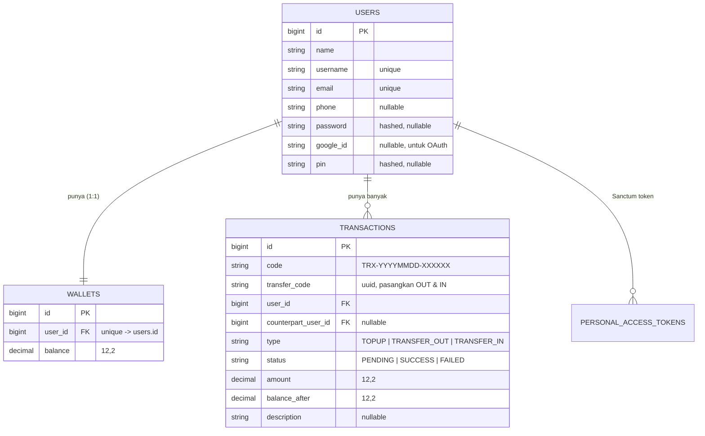

# TrustPay — Dompet Digital

Aplikasi **e-wallet full-stack** bertema *"Buku Tabungan Digital"* — setiap rupiah tercatat, setiap transaksi aman.
Dibuat sebagai proyek portfolio untuk Exam Penyaluran Kerja, Dibimbing Full Stack Web Development.

**Live Demo**
- Frontend: https://trust-pay-blush.vercel.app
- Backend API: https://trustpay-api-ieep.onrender.com/api

---

## Tech Stack

| Layer | Teknologi |
|---|---|
| Backend | PHP 8.4, Laravel 13, Laravel Sanctum (token auth), bcmath |
| Database | SQLite (lokal) / PostgreSQL (production di Render) |
| Frontend | React 18, Vite 5, React Router 6 |
| Deployment | Render (backend Docker) + Vercel (frontend SPA) |
| Payment | Midtrans Snap (sandbox) |
| OAuth | Google OAuth 2.0 via Laravel Socialite |
| OTP | Fonnte WhatsApp Gateway (bonus) |

---

## Fitur

### Auth
- Register (nama, username, email, HP opsional, password)
- Login email/username + password
- Login OTP WhatsApp *(bonus)*
- Login / Register via Google *(bonus)*
- Logout (hapus token Sanctum)

### Wallet & Transaksi
- **Top Up** — via Midtrans Snap (VA BCA/BNI/BRI, QRIS, dll)
- **Transfer** — ke sesama user TrustPay (by email / HP / @username)
- **Bayar Tagihan** — Pulsa, Listrik PLN, Air PDAM, Internet (demo — potong saldo nyata)
- **Scan QRIS** — kamera scan QR code merchant, konfirmasi bayar + PIN
- **Terima QR** — tampilkan QR statis untuk diterima user lain
- **Voucher** — redeem kode voucher untuk tambah saldo
- **Cashback** — promo cashback otomatis berdasarkan konfigurasi aktif

### Dashboard
- Saldo real-time dengan toggle sembunyikan
- Riwayat transaksi lengkap (TOPUP / MASUK / KELUAR)
- Filter per tipe, tanggal, dan pencarian teks
- Export CSV & Print PDF ledger
- Ringkasan bulanan (total masuk / keluar)
- Panel notifikasi (10 transaksi terbaru)
- Struk transaksi printable

### Keamanan
- **PIN 6-digit wajib** untuk setiap Transfer & Pembayaran
- Token Sanctum disimpan di cookie (HttpOnly, SameSite=Strict)
- Password di-hash bcrypt otomatis via model cast
- Generic error message (anti-enumeration)
- `lockForUpdate` + DB transaction untuk transfer atomik

### Profil
- Lihat & edit info akun (nama, email, HP, username)
- Atur / ubah PIN transaksi
- Level akun Basic / Premium

---

## ERD (Entity Relationship Diagram)



> Transfer mencatat **2 baris**: `TRANSFER_OUT` (pengirim) & `TRANSFER_IN` (penerima),
> dihubungkan `transfer_code` yang sama. Setiap user hanya melihat baris miliknya sendiri.

---

## API Endpoints

### Public

| Method | Path | Keterangan |
|---|---|---|
| POST | `/api/register` | Daftar akun baru |
| POST | `/api/login` | Login email/username + password |
| POST | `/api/login/request-otp` | Kirim OTP ke WhatsApp |
| POST | `/api/verify-otp` | Verifikasi kode OTP |
| GET | `/api/auth/google/redirect` | Redirect ke Google OAuth |
| GET | `/api/auth/google/callback` | Callback Google OAuth |
| POST | `/api/webhooks/midtrans` | Webhook status pembayaran Midtrans |

### Protected (Bearer Token)

| Method | Path | Keterangan |
|---|---|---|
| GET | `/api/me` | Data user saat ini |
| PUT | `/api/me` | Edit profil |
| POST | `/api/pin` | Atur / ubah PIN transaksi |
| POST | `/api/logout` | Logout |
| GET | `/api/wallet` | Saldo wallet |
| POST | `/api/topup` | Inisialisasi top up (Midtrans) |
| POST | `/api/topup/confirm` | Konfirmasi status top up |
| POST | `/api/transfer` | Transfer ke user lain *(butuh PIN)* |
| POST | `/api/pay` | Bayar tagihan *(butuh PIN)* |
| GET | `/api/transactions` | Riwayat transaksi |
| GET | `/api/promos` | Daftar promo & cashback aktif |
| POST | `/api/vouchers/redeem` | Redeem kode voucher |

### Kode Status

| Kode | Arti |
|---|---|
| 200/201 | Sukses |
| 401 | Token tidak valid / salah password |
| 400 | Aturan bisnis dilanggar (saldo tidak cukup, dll) |
| 422 | Input tidak valid / PIN salah |
| 403 | PIN belum diatur |

---

## Struktur Folder

```
TrustPay/
├── backend/
│   ├── app/
│   │   ├── Http/Controllers/
│   │   │   ├── AuthController.php
│   │   │   ├── WalletController.php
│   │   │   ├── ProfileController.php
│   │   │   ├── SocialAuthController.php
│   │   │   └── MidtransWebhookController.php
│   │   ├── Services/WalletService.php
│   │   └── Models/ (User, Wallet, Transaction, Voucher)
│   ├── routes/api.php
│   ├── Dockerfile
│   └── start.sh
│
└── frontend/
    ├── src/
    │   ├── pages/       (Landing, Dashboard, Login, Register, Profile, AuthCallback)
    │   ├── components/  (Modal, Panel, PinModal, ScanQRModal, dll)
    │   ├── hooks/       (useAuth, useWallet)
    │   └── lib/         (api.js, auth.js, wallet.js, theme.js)
    └── vercel.json
```

---

## Setup Lokal

### Prasyarat
- PHP 8.4+, Composer 2
- Node.js 20+, npm
- SQLite (sudah bundled di PHP)

### Backend

```bash
cd backend
cp .env.example .env
php artisan key:generate
php artisan migrate --seed
php artisan serve
# berjalan di http://localhost:8000
```

### Frontend

```bash
cd frontend
npm install
npm run dev
# berjalan di http://localhost:5173
```

Vite proxy `/api` → `http://localhost:8000` sudah dikonfigurasi — tidak perlu ubah apapun untuk dev lokal.

---

## Environment Variables

### Backend (`backend/.env`)

```env
APP_URL=http://localhost:8000
DB_CONNECTION=sqlite

# Midtrans — ambil dari dashboard.sandbox.midtrans.com
MIDTRANS_SERVER_KEY=SB-Mid-server-xxxx
MIDTRANS_CLIENT_KEY=SB-Mid-client-xxxx
MIDTRANS_IS_PRODUCTION=false

# Google OAuth — ambil dari console.cloud.google.com
GOOGLE_CLIENT_ID=xxxx.apps.googleusercontent.com
GOOGLE_CLIENT_SECRET=GOCSPX-xxxx
GOOGLE_REDIRECT_URI=http://localhost:8000/api/auth/google/callback

# URL frontend (untuk redirect setelah OAuth)
FRONTEND_URL=http://localhost:5173

# OTP WhatsApp (opsional; default: log ke storage/logs/laravel.log)
OTP_CHANNEL=log
FONNTE_TOKEN=
```

### Frontend (`frontend/.env`)

```env
VITE_API_URL=/api
VITE_MIDTRANS_CLIENT_KEY=SB-Mid-client-xxxx
```

---

## Deployment

### Backend → Render (Docker)

1. Push ke GitHub → Render New Web Service → Docker
2. Set environment variables di Render Dashboard (semua di atas + `DATABASE_URL`)
3. `FRONTEND_URL` diisi URL Vercel (tanpa trailing slash)
4. Deploy otomatis dari branch `main`

### Frontend → Vercel

1. Vercel → New Project → Import dari GitHub
2. Root Directory: `frontend`
3. Set env vars:
   - `VITE_API_URL` = `https://<backend>.onrender.com/api`
   - `VITE_MIDTRANS_CLIENT_KEY` = Midtrans client key
4. `vercel.json` sudah ada untuk SPA routing (rewrites ke `index.html`)

---

## Akun Demo

| Field | Value |
|---|---|
| Password seeder | `password123` |
| PIN demo | `123456` |

> Top Up menggunakan Midtrans **sandbox** — gunakan kartu/VA test dari [docs.midtrans.com](https://docs.midtrans.com/docs/testing-payment).

---

*Dibuat oleh **Saifudin Reza** — Exam Full Stack Web Development, Dibimbing.id · 2026*
